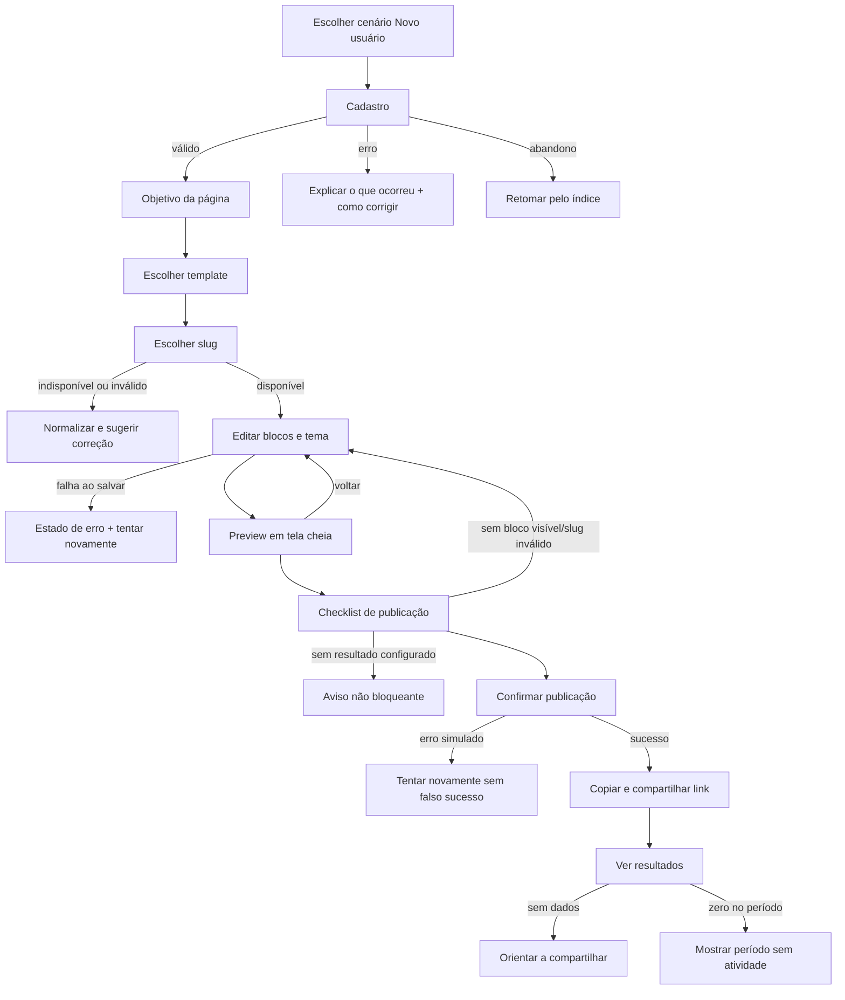
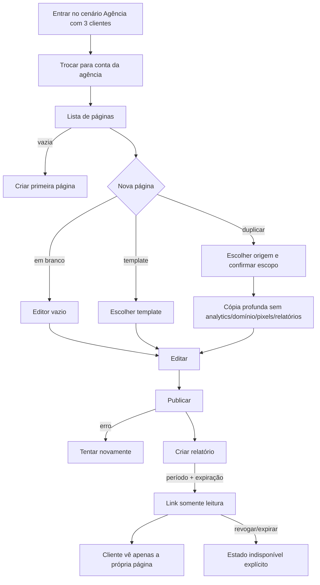

# Jornadas da Sprint 1

Estas jornadas definem a experiência a validar antes do schema multi-tenant. Os eventos são propostas para a taxonomia da Sprint 6; no protótipo ficam apenas no navegador.

## J1 — profissional individual

| Etapa | Objetivo do usuário | Rota/tela | Ação principal | Possível falha | Estado mostrado | Evento proposto | Orçamento |
|---|---|---|---|---|---|---|---:|
| Entrada | Começar sem configurar ferramentas | `/proto` | Escolher “Novo usuário” | Cenário anterior interfere | Reinício confirmado | `session_started` | 0:20 |
| Cadastro | Criar acesso | `/proto/cadastro` | Continuar | Campo inválido ou erro simulado | Validação inline, carregando, erro neutro | `signup_completed` | 1:00 |
| Objetivo | Dizer o que a página deve gerar | `/proto/onboarding` | Escolher objetivo | Nenhuma escolha | Instrução contextual | `goal_selected` | 0:40 |
| Template | Partir de uma estrutura útil | `/proto/onboarding` | Escolher template | Dúvida entre opções | Caso de uso e resultado esperado | `template_selected` | 0:45 |
| Endereço | Obter URL memorável | `/proto/onboarding` | Confirmar slug | Reservado, usado, curto ou caracteres inválidos | Normalização ao vivo e próximo passo | `slug_chosen` / `error_shown` | 1:00 |
| Edição | Ajustar conteúdo e visual | `/proto/editor/novo` | Editar/adicionar blocos | Salvamento falha | Salvando, salvo ou tentar novamente; pendência separada | `block_added`, `block_edited` | 3:30 |
| Preview | Conferir como visitante | `/proto/editor/novo?preview=1` | Revisar página | CTA incorreto | Preview completo e retorno à edição | `preview_opened` | 0:45 |
| Publicação | Colocar a versão no ar | Editor, etapa publicar | Confirmar | Item bloqueante ou falha de publicação | Checklist, publicando, erro ou sucesso | `publish_clicked`, `publish_succeeded`, `publish_failed` | 1:00 |
| Compartilhar | Levar visitas à página | Sucesso de publicação | Copiar link | Clipboard indisponível | Link selecionável e sugestões | `public_link_copied` | 0:30 |
| Resultados | Entender visitas e ações | `/proto/analytics/novo` | Ver período | Sem dados, zero, erro | Estados semanticamente distintos | `analytics_viewed` | 0:30 |

**Total-alvo J1: 9min00s.** Abandono é registrado pelo último evento concluído e pode ser retomado pelo índice do protótipo.

## J2 — agência

| Etapa | Objetivo do usuário | Rota/tela | Ação principal | Possível falha | Estado mostrado | Evento proposto | Orçamento |
|---|---|---|---|---|---|---|---:|
| Cenário | Ver operação com dados realistas | `/proto` | Selecionar agência | Dados locais anteriores | Reinício e seed confirmados | `session_started` | 0:20 |
| Contexto | Trabalhar na conta correta | `/proto/w/agencia-aurora/perfis` | Trocar workspace | Contexto pessoal selecionado | Nome e uso do plano persistentes | `workspace_switched` | 0:20 |
| Portfólio | Encontrar cliente | Lista de páginas | Buscar/filtrar | Nenhum resultado ou lista vazia | Empty state com ação de saída | `profile_list_viewed` | 0:40 |
| Criação | Reaproveitar trabalho | Modal “Nova página” | Duplicar/template/em branco | Limite ou origem ausente | Explicação do que será copiado | `profile_creation_started` | 1:00 |
| Duplicação | Criar cópia independente | Modal de duplicação | Confirmar | Erro simulado futuro | Cópia criada e selecionada | `profile_duplicated` | 0:40 |
| Edição | Adequar conteúdo do cliente | `/proto/editor/[profileId]` | Editar blocos/tema | Falha de save | Estados de salvamento explícitos | `block_edited` | 2:30 |
| Publicação | Disponibilizar página | Editor | Publicar | Checklist/falha | Publicando, sucesso ou erro | `publish_clicked`, `publish_succeeded` | 1:00 |
| Relatório | Prestar contas sem expor configurações | Lista/detalhe | Criar link com expiração | Data inválida | Confirmação e lista de links | `report_link_created` | 1:00 |
| Leitura | Cliente entende resultados | `/proto/r/[token]` | Abrir relatório | Expirado/revogado | Estado seguro sem dados internos | `report_viewed` | 0:40 |

## Pontos de abandono e recuperação

- Cadastro/onboarding: o índice reinicia ou retoma o estado local sem afirmar que existe conta real.
- Editor: cada mutação mostra salvamento; uma falha mantém as alterações locais e oferece nova tentativa.
- Publicação: falha não altera o status para publicado.
- Agência: busca vazia preserva filtros e oferece limpar busca; arquivamento exige confirmação simples.
- Relatório: expiração ou revogação não revela se outro token existe.
